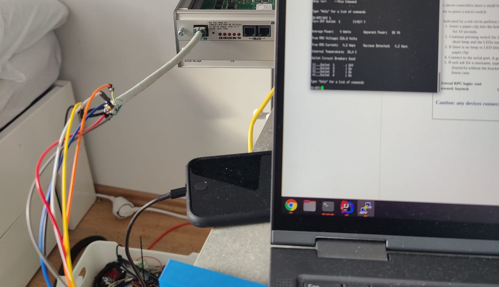

# About
This is a more private project, created to control my 3D printer.
You meight be able to build it by your self, using the same parts, but I'm using some more crazy
stuff and self made solutions as needed.
This project is also used to train my Python skills, some things might look and work funny.
The printer will be placed insinde a IKEA Plasta base.

# Parts
The main part is a Raspberry Pi 3 with OctoPi installed. The external parts like heater, light
filter and the printer power is controlled using a DS4A-RPC I've got some time ago.
You might also get a cheep one or use a similar device. I've used the DS4A (https://www.baytech.net/product/dsrpc/)
mostly, because of the inrush current
created by the power supplies and spools always melted the relays used.
The DS4A-RPC is controlled using a serial connection, using a custom-made adapter, defined
in the manual of the device.

Here is the "custom made" replacement adapter pinout, I've created:

| [9-Pin D-SUB](https://upload.wikimedia.org/wikipedia/commons/thumb/e/ee/CAN_Connecteur.svg/220px-CAN_Connecteur.svg.png) | 4     |   | 7     | 3          | 2    | 6           | 5      | 8            |
|--------------|-------|---|-------|------------|------|-------------|--------|--------------|
| [RJ45](https://upload.wikimedia.org/wikipedia/commons/thumb/5/5b/Cat5-plain-dot.svg/2000px-Cat5-plain-dot.svg.png)        | Brown |   | Green | Blue&White | Blue | Green-White | Orange | Orange-White |

Specific for this device, I've then implemented the following flow into Switch.py

;;;; - Used to get back to the main menu, used when calling the init() function
5 - To open the outlet control menu

In order to change the state the
**On (PORT)** followed by a **Y** is used to turn on, and **Off (PORT)** for off.
That's it.

I've also added a DHT22 AM2302 sensor for measuring the temp. and a cheap digital light sensor
I probably will use to detect an open door.
There is also a dust sensor planed, still waiting for the delivery.
I'm also thinking about a audio measurement of my Webcam, detecting the high pitched noise of
the smoke detector over the printer.

https://www.makeuseof.com/tag/add-button-raspberry-pi-project/